# Two portraits of Brazil with and without Lockdown against Covid-19

## 1 - Introduction
This project is part of the course "Online Diploma in Python Programming" of IBAT College Dublin and is the second assignment of the course. The purpose of the second assignment is using the things that we learn during the course and analyse a dataset. For this activity I choose an exploratory analyse the coronavírus cases for two cities in Brazil and compare the way that this two cities handled with the spread of the virus

```python
!pip install newspaper3k
!pip install google_trans_new
!pip install wordcloud
```
```python
#Libraries that we will need to the analysis
from bs4 import BeautifulSoup
import requests
import pandas as pd
import re
import folium
import newspaper
from newspaper import Article
from matplotlib import pyplot as plt
import matplotlib.patches as mpatches
from wordcloud import WordCloud
import numpy as np
from numpy import array
from google_trans_new import google_translator
```

```python
#Activating the translator variable to translate the articles from portuguese to english
translator = google_translator() 
```

## 2 - The problem
It's clear that Brazil is not doing their best to handle the spread of the coronavirus. Leaving the political reasons aside, the country is registering day by day new records of contamination and deaths.

A lot of countries around the world already closed their borders to receiving tourists and students from Brazil.

After we received this assignment, I was thinking about what kind of dataset I could analise and how to bring value when I read an article about the way that Araraquara, a small city in the countryside of São Paulo, is handling the spread of coronavírus.

After a few days of lockdown, Araraquara reduced to zero for two days the number of deaths in a period that the state was breaking every day the record of deaths.

I started to search for more information about that and found a really interesting article from BBC comparing the way that Araraquara and Bauru, another small countryside city of São Paulo, handled the spread of the virus and how lockdown impacted on the occupancy rate in the hospitals.

### 2.1 Araraquara x Bauru: Two portraits of Brazil with and without Lockdown against Covid-19

```python
#I used the technique of web scraping to bring the article for contextualization of the problem
url = 'https://www.bbc.com/portuguese/brasil-56640000' #address of the article
article = Article(url) #the "article" will get the URL download the content for parsing
article.download()
article.parse() 

print("From BBC Brasil")
print()
print(translator.translate(article.title, 'en')) #Here I'm getting the article title and translating from brazilian portuguese for english
print()
print(translator.translate(article.text[609:2030], 'en')) #Here I'm getting the article content and translating from brazilian portuguese for english
```

From BBC Brasil

Araraquara x Bauru: Two portraits of Brazil with and without Lockdown against Covid-19 

While the State Government of São Paulo imposed a series of restrictions (see below), two municipalities draw attention to opposing postures against the pandemic. Bauru and Araraquara are separated by about 100 km.

On the one hand, the mayor of Araraquara, Edinho Silva (PT), decreed a rigorous lockdown in February, after a sudden increase in cases numbers and use of ICU beds. The municipality has suspended all services that have no direct relationship with the health area, including public transportation and supermarkets - which could only function by the Delivery system.

In Bauru, the mayor Suérlen Rosim (Patriot) imposed lighter restrictions. It advocates the opening of stores and has declared that Lockdown does not work. In Instagram, Rosim published a video of a careau that, in her words, asked for the "responsible opening of local commerce." In another publication in which she appears singing in a church, in February, the mayor said that "everything should be considered essential in almost a year of pandemic."

In interviews, Rosim also criticized restrictions imposed by the state government to try to reduce Covid-19 cases and said the Lockdown "would not work in Bauru."

"Araraquara is proof of this," she told Portal UOL.

After the Lockdown, however, Araraquara saw fall in daily cases and deaths. Already in Bauru, in recent weeks, both the daily average of deaths and cases rose. 

## 3 - Cities Profile
Before we start to analyze the data I believe that it is important to present these two cities. Both are small cities in the countryside of São Paulo.

The state of São Paulo is divided in 645 cities, distributed in 42 government regions and 14 administrative regions compost for 3 metropolitan regions: São Paulo, Baixada Santista and Campinas. Araraquara and Bauru are part of the region of São Paulo.

### 3.1 - Araraquara Profile
```python
url="https://www.ibge.gov.br/cidades-e-estados/sp/araraquara.html"

data = requests.get(url).content

soup = BeautifulSoup(data,'html.parser')

indice = []
for div in soup.find_all ('div', class_ = ['indicador']):
    for p in div.find_all ('p', class_ = ['ind-label']):
        title = p.text
        translateText = translator.translate(title, 'en')
        indice.append(translateText)

content = []
for div in soup.find_all ('div', class_ = ['indicador']):
    for p in div.find_all ('p', class_ = ['ind-value']):
        content.append(p.text)

df = pd.DataFrame()
df.insert(loc=0, column='Indice', value=indice)
df.insert(loc=1, column='Content', value=content)
df
```
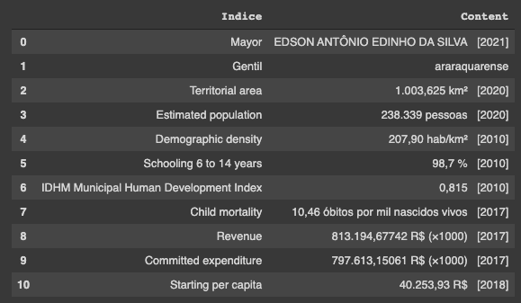

### 3.2 - Bauru Profile
```python
url="https://www.ibge.gov.br/cidades-e-estados/sp/bauru.html?"

data = requests.get(url).content

soup = BeautifulSoup(data,'html.parser')

indice = []
for div in soup.find_all ('div', class_ = ['indicador']):
    for p in div.find_all ('p', class_ = ['ind-label']):
        title = p.text
        translateText = translator.translate(title, 'en')
        indice.append(translateText)

content = []
for div in soup.find_all ('div', class_ = ['indicador']):
    for p in div.find_all ('p', class_ = ['ind-value']):
        content.append(p.text)
        
df = pd.DataFrame()
df.insert(loc=0, column='Indice', value=indice)
df.insert(loc=1, column='Content', value=content)
df
```

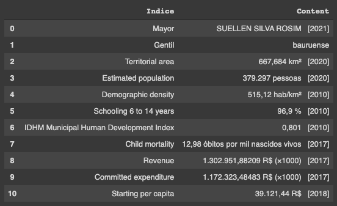

### 3.3 - Cities Location
```python
citiesMap = folium.Map(
    location=[-21.996486337670348, -48.39041978519532],
    tiles='Stamen Terrain',
    zoom_start=9,
    width=1000,
    height=600
)

folium.Marker(location=[-21.775619806553884, -48.178686110676004],popup='Araraquara | São Paulo',tooltip='Araraquara | São Paulo').add_to(citiesMap)
folium.Marker(location=[-22.314992394647277, -49.053027334706975],popup='Bauru | São Paulo',tooltip='Bauru | São Paulo').add_to(citiesMap)

citiesMap
```

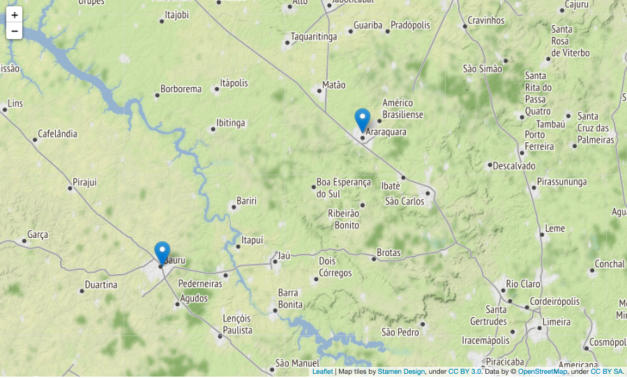

## 4 - Coronavírus Brazil Datasets
The datasets that we will analyse was downloaded from these two websites:

Cases and Deaths Dataset: BRASIL.IO (https://brasil.io/). I tried to get the information from the datasus (the official platform for Brazilian Government), but the archive for datasus is corrupted. Because of that I get the same dataset from BRASIL.IO, which is a project made by developers and compile data from official databases through the transparency law from Brazil and organize in structure dataset to download.

Hospitals Occupancy Rate Dataset: Government of São Paulo (https://www.seade.gov.br/coronavirus/). I get the occupancy rate data from the official government of São Paulo website.

### 4.1 - Importing the Datasets
### 4.1.2 - Cases & Deaths Dataset

```python
casesAndDeathsdf = pd.read_csv ('Cases_and_Deaths_30Abr2021.csv')
```

### 4.1.3 - Occupancy Rate Dataset

```python 
occupancyRatedf = pd.read_csv ('Hospital_occupation_rate_30Abr2021.txt', sep=";")
```

## 4.2 - Walking through Dataset
### 4.2.1 - Cases and Deaths Resume
#### 4.2.1.1 - Araraquara Resume

```python
columnsFilter = casesAndDeathsdf.filter(items = ['city','date','last_available_death_rate','new_confirmed','new_deaths'])
casesAndDeathsararaquaraResume = columnsFilter.loc[(casesAndDeathsdf['city'] == 'Araraquara')]
casesAndDeathsararaquaraResume.describe()
```

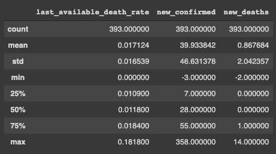

#### 4.2.1.2 - Bauru Resume
```python
columnsFilter = casesAndDeathsdf.filter(items = ['city','date','last_available_death_rate','new_confirmed','new_deaths'])
casesAndDeathsbauruResume = columnsFilter.loc[(casesAndDeathsdf['city'] == 'Bauru')]
casesAndDeathsbauruResume.describe()
```

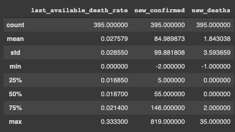

### 4.2.2 - Ocuppancy Rate Resume
#### 4.2.2.1 - Araraquara Resume

```python
columnsFilter = occupancyRatedf.filter(items = ['datahora','ocupacao_leitos_ultimo_dia','pacientes_enf_ultimo_dia','nome_drs'])
ocuppancyRateAraraquaraResume = columnsFilter.loc[(occupancyRatedf['nome_drs'] == 'DRS 03 Araraquara')]
ocuppancyRateAraraquaraResume.describe()
```

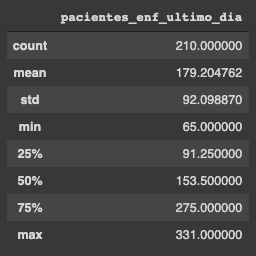

#### 4.2.2.1 - Bauru Resume
```python
columnsFilter = occupancyRatedf.filter(items = ['datahora','ocupacao_leitos_ultimo_dia','pacientes_enf_ultimo_dia','nome_drs'])
ocuppancyRateBauruResume = columnsFilter.loc[(occupancyRatedf['nome_drs'] == 'DRS 06 Bauru')]
ocuppancyRateBauruResume.describe()
```

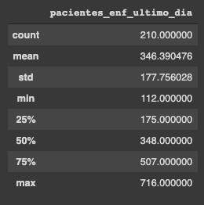

## 4.3 - Filtering the datasets
```python
columnsFilter = casesAndDeathsdf.filter(items = ['city','date','last_available_death_rate','new_confirmed','new_deaths'])
casesAndDeathCitiesdf = columnsFilter.loc[(casesAndDeathsdf['city'] == 'Araraquara') | (casesAndDeathsdf['city'] == 'Bauru')]
casesAndDeathCitiesdf.set_index('date', inplace = True)
casesAndDeathCitiesdf.head(11)
```

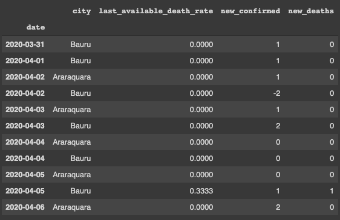

```python
columnsFilter = occupancyRatedf.filter(items = ['datahora','ocupacao_leitos_ultimo_dia','pacientes_enf_ultimo_dia','nome_drs'])
ocuppancyRateCitiesdf = columnsFilter.loc[(occupancyRatedf['nome_drs'] == 'DRS 03 Araraquara') | (occupancyRatedf['nome_drs'] == 'DRS 06 Bauru')]
ocuppancyRateCitiesdf.set_index('datahora', inplace = True)
ocuppancyRateCitiesdf.head(11)
```

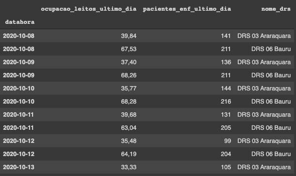

## 5 - The lockdown was decreed
```pytnon
url = 'https://agenciabrasil.ebc.com.br/saude/noticia/2021-02/araraquara-entra-em-lockdown-para-frear-disseminacao-de-covid-19'
article = Article(url)
article.download()
article.parse() 

print("Article from Agência Brasil")
print()
print(translator.translate(article.title, 'en'))
print()
print(translator.translate(article.text[:1661], 'en'))
```
Article from Agência Brasil

Araraquara enters Lockdown to brake Dissemination of Covid-19 

From 12pm today (21) until 23h59 of next Tuesday (23), the city of Araraquara, in the interior of São Paulo, is in Lockdown, with prohibition of circulation on the streets. The goal is to try to brake the spread of new coronavirus strains circulating in the municipality. Araraquara is 270 kilometers (km) from the capital of São Paulo, with population estimated at 238, 3 thousand people.

The infirmary and intensive care unit (ICU) beds operate with total occupation in the municipality's health units and close to the limit throughout the region. According to the City Hall, there was also a significant increase in contaminations and complications of the disease in younger patients.

The amount of deaths by Covid-19 in Araraquara doubled in February (in only 19 days) compared to the whole January, when 24 people died as a result of the disease. This month, when the Manaus strain was detected, there were 2,633 new cases and 51 deaths, 21 last week. In total, the municipality recorded 171 deaths resulting from Covid-19 from the beginning of the pandemic, last year.

According to the epidemiological bulletin this Sunday, another 217 new cases of the disease were recorded, totaling 13,454 cases. Today, 218 patients are hospitalized, being 63 in ICU.

Therefore, on February 15, a municipal decree has been entered into force, and on Friday (19), the City Hall edited new document by increasing the circulation constraints. From Wednesday (24), the city returns to the red phase of the São Paulo plan, with the same measures established in the previous decree, with the operation of essential services until 8pm. 

### 5.1 - The situation of the cities

```python
#The quantity of cases on the Araraquara and Bauru on the first day of lockdown
dayBeforeLockdownCases = casesAndDeathCitiesdf.loc['2021-02-21']
dayBeforeLockdownCases
```

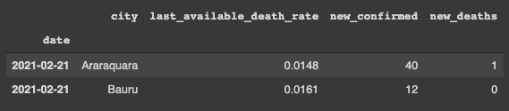

```python
#The occupancy rate of the Araraquara and Bauru on the first day of lockdown
dayBeforeLockdownOccupancy = ocuppancyRateCitiesdf.loc['2021-02-21']
dayBeforeLockdownOccupancy
```

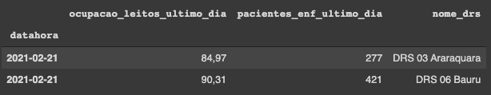

### 5.2 - The progression of the situation
The progression of the cases, deaths and hospital occupancy rate from a month before 21 February, the day that Araraquara started the full lockdown.

```python
#filtering the range of the dates that we will need
previousSituation = casesAndDeathCitiesdf.loc['2021-01-21':'2021-02-21']
previousSituation.reset_index(inplace = True)
```

### 5.2.1 - New cases
```python
#creating the range of dates that we will use as x axis
x_axis = pd.date_range(start="2021-01-21",end="2021-02-21")

#we will use both cities in y axis
araraquaraFilter = previousSituation.loc[(previousSituation['city'] == 'Araraquara')]
confirmedAraraquara = araraquaraFilter.filter(items = ['new_confirmed'])

bauruFilter = previousSituation.loc[(previousSituation['city'] == 'Bauru')]
confirmedBauru = bauruFilter.filter(items = ['new_confirmed'])

#putting everything together on the graph
plt.figure(figsize=(15,10))
plt.title('ARARAQUARA vs BAURU (Nº of New Cases)')
plt.title('01 Jan to 21 fev', loc='right', fontstyle='italic')
plt.plot(x_axis,confirmedAraraquara, color='blue')
plt.plot(x_axis,confirmedBauru, color='red')
araraquaraLabel = mpatches.Patch(color='blue', label='Araraquara')
bauruLabel = mpatches.Patch(color='red', label='Bauru')
plt.legend(handles=[araraquaraLabel,bauruLabel])
plt.show
```

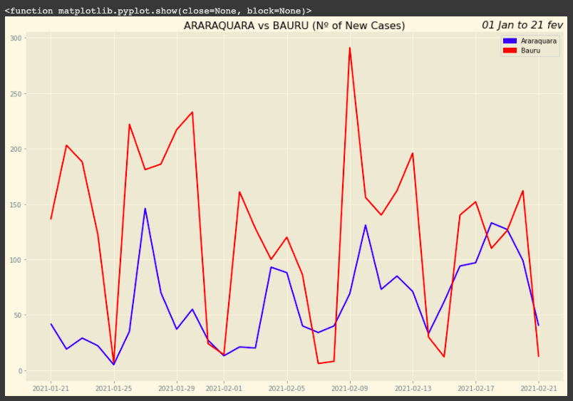

### 5.2.2 - Number of deaths
```python
#creating the range of dates that we will use as x axis
x_axis = pd.date_range(start="2021-01-21",end="2021-02-21")

#we will use both cities in y axis
araraquaraFilter = previousSituation.loc[(previousSituation['city'] == 'Araraquara')]
confirmedAraraquara = araraquaraFilter.filter(items = ['new_deaths'])

bauruFilter = previousSituation.loc[(previousSituation['city'] == 'Bauru')]
confirmedBauru = bauruFilter.filter(items = ['new_deaths'])

#putting everything together on the graph
plt.figure(figsize=(15,10))
plt.title('ARARAQUARA vs BAURU (Nº of New Deaths)')
plt.title('01 Jan to 21 fev', loc='right', fontstyle='italic')
plt.plot(x_axis,confirmedAraraquara, color='blue')
plt.plot(x_axis,confirmedBauru, color='red')
araraquaraLabel = mpatches.Patch(color='blue', label='Deaths in Araraquara')
bauruLabel = mpatches.Patch(color='red', label='Deaths in Bauru')
plt.legend(handles=[araraquaraLabel,bauruLabel])
plt.show
```

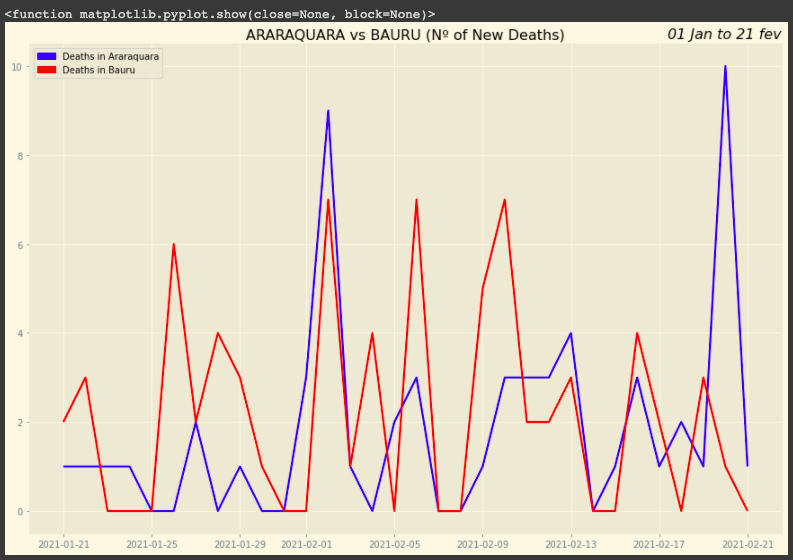

### 5.2.2 - Death Rate
```python
#creating the range of dates that we will use as x axis
x_axis = pd.date_range(start="2021-01-21",end="2021-02-21")

#we will use both cities in y axis
araraquaraFilter = previousSituation.loc[(previousSituation['city'] == 'Araraquara')]
confirmedAraraquara = araraquaraFilter.filter(items = ['last_available_death_rate'])

bauruFilter = previousSituation.loc[(previousSituation['city'] == 'Bauru')]
confirmedBauru = bauruFilter.filter(items = ['last_available_death_rate'])

#putting everything together on the graph
plt.figure(figsize=(15,10))
plt.title('ARARAQUARA vs BAURU (Death Rate)')
plt.title('01 Jan to 21 fev', loc='right', fontstyle='italic')
plt.plot(x_axis,confirmedAraraquara, color='blue')
plt.plot(x_axis,confirmedBauru, color='red')
araraquaraLabel = mpatches.Patch(color='blue', label='Death Rate from Araraquara')
bauruLabel = mpatches.Patch(color='red', label='Death Rate from Bauru')
plt.legend(handles=[araraquaraLabel,bauruLabel])
plt.show
```


### 5.2.3 - Hospital Occupancy Rate
```python
#filtering the range of the dates that we will need
previousSituation = ocuppancyRateCitiesdf.loc['2021-01-21':'2021-02-21']
previousSituation.reset_index(inplace = True)
```
```python
#creating the range of dates that we will use as x axis
x_axis = pd.date_range(start="2021-01-21",end="2021-02-21")

'''For the data from the field "ocupacao_leitos_ultimo_dia" or in english occupancy rate for the last day, 
the Department of Health of São Paulo used the separator comma instead of dot. But matplotlib and numpy 
can't work with commas in this particular case (I believe), so only in this case, before plotting the 
graph I'm converting all the commas to dot.'''

#we will use both cities in y axis. 
cityFilterAraraquara = previousSituation.loc[(previousSituation['nome_drs'] == 'DRS 03 Araraquara')]
occupancyAraraquara = cityFilterAraraquara.filter(items = ['ocupacao_leitos_ultimo_dia'])
occupancyAraraquaraconverted = [i.replace(',', '.') for i in occupancyAraraquara['ocupacao_leitos_ultimo_dia']]

cityFilterBauru = previousSituation.loc[(previousSituation['nome_drs'] == 'DRS 06 Bauru')]
occupancyBauru = cityFilterBauru.filter(items = ['ocupacao_leitos_ultimo_dia'])
occupancyBauruconverted = [i.replace(',', '.') for i in occupancyBauru['ocupacao_leitos_ultimo_dia']]

#putting everything together on the graph
plt.figure(figsize=(20,15))
plt.style.use('Solarize_Light2')
plt.title('ARARAQUARA vs BAURU (Occupancy Rate)')
plt.title('21 Jan to 21 fev', loc='right', fontstyle='italic')
plt.plot(x_axis,occupancyAraraquaraconverted, color='blue')
plt.plot(x_axis,occupancyBauruconverted, color='red')
araraquaraLabel = mpatches.Patch(color='blue', label='Occupancy Rate from Araraquara')
bauruLabel = mpatches.Patch(color='red', label='Occupancy Rate from Bauru')
plt.legend(handles=[araraquaraLabel,bauruLabel])
plt.show
```

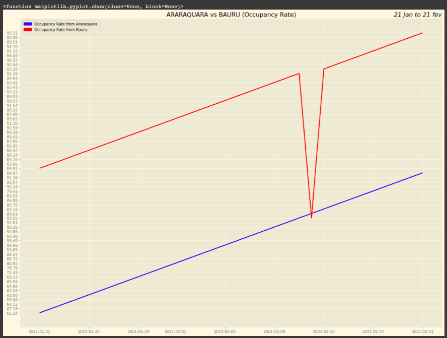

### 5.2.4 - Patients in Nursing Beds for COVID-19
```python
#creating the range of dates that we will use as x axis
x_axis = pd.date_range(start="2021-01-21",end="2021-02-21")

#we will use both cities in y axis
cityFilterAraraquara = previousSituation.loc[(previousSituation['nome_drs'] == 'DRS 03 Araraquara')]
nursingBedsAraraquara = cityFilterAraraquara.filter(items = ['pacientes_enf_ultimo_dia'])

cityFilterBauru = previousSituation.loc[(previousSituation['nome_drs'] == 'DRS 06 Bauru')]
nursingBedsBauru = cityFilterBauru.filter(items = ['pacientes_enf_ultimo_dia'])

#putting everything together on the graph
plt.figure(figsize=(20,15))
plt.style.use('Solarize_Light2')
plt.title('ARARAQUARA vs BAURU (Patients in Nursing beds)')
plt.title('21 Jan to 21 fev', loc='right', fontstyle='italic')
plt.plot(x_axis,nursingBedsAraraquara, color='blue')
plt.plot(x_axis,nursingBedsBauru, color='red')
araraquaraLabel = mpatches.Patch(color='blue', label='Patients in Nursing beds from Araraquara')
bauruLabel = mpatches.Patch(color='red', label='Patients in Nursing beds from Bauru')
plt.legend(handles=[araraquaraLabel,bauruLabel])
plt.show
```

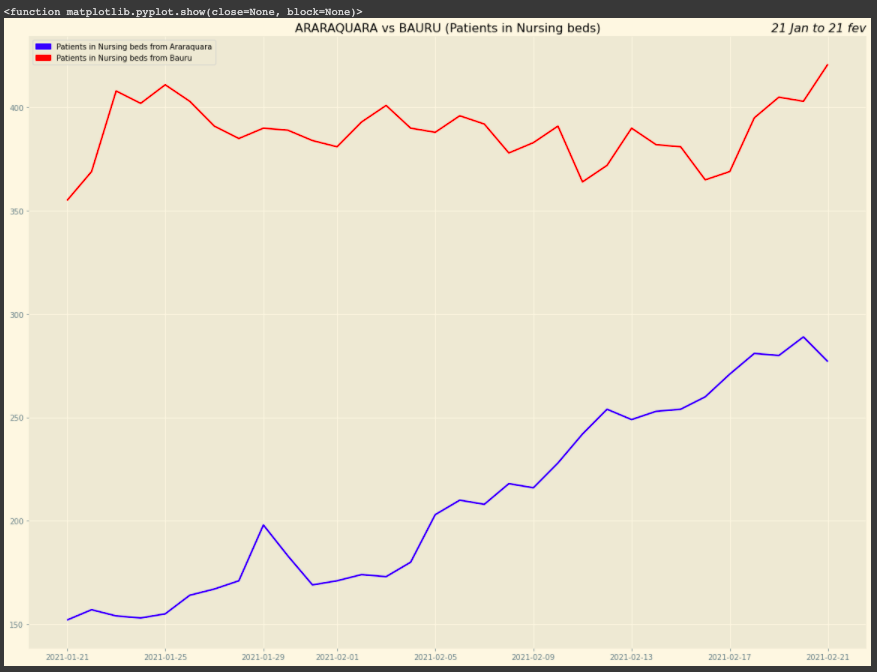

## 5.3 - The scenario after the lockdown
```python
#filtering the range of the dates that we will need
afterSituation = casesAndDeathCitiesdf.loc['2021-03-03':'2021-04-03']
afterSituation.reset_index(inplace = True)
```
### 5.3.1 - New cases
```python
#creating the range of dates that we will use as x axis
x_axis = pd.date_range(start="2021-03-03",end="2021-04-03")

#we will use both cities in y axis
araraquaraFilter = afterSituation.loc[(afterSituation['city'] == 'Araraquara')]
confirmedAraraquara = araraquaraFilter.filter(items = ['new_confirmed'])

bauruFilter = afterSituation.loc[(afterSituation['city'] == 'Bauru')]
confirmedBauru = bauruFilter.filter(items = ['new_confirmed'])

#putting everything together on the graph
plt.figure(figsize=(15,10))
plt.title('ARARAQUARA vs BAURU (Nº of News Cases)')
plt.title('03 Mar to 03 Abr', loc='right', fontstyle='italic')
plt.plot(x_axis,confirmedAraraquara, color='blue')
plt.plot(x_axis,confirmedBauru, color='red')
araraquaraLabel = mpatches.Patch(color='blue', label='New Cases Araraquara')
bauruLabel = mpatches.Patch(color='red', label='New Cases Bauru')
plt.legend(handles=[araraquaraLabel,bauruLabel])
plt.show
```

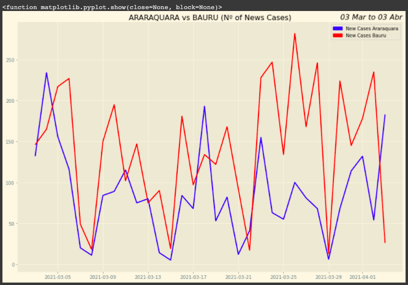

### 5.3.2 - Number of Deaths
```python
#creating the range of dates that we will use as x axis
x_axis = pd.date_range(start="2021-03-03",end="2021-04-03")

#we will use both cities in y axis
araraquaraFilter = afterSituation.loc[(afterSituation['city'] == 'Araraquara')]
confirmedAraraquara = araraquaraFilter.filter(items = ['new_deaths'])

bauruFilter = afterSituation.loc[(afterSituation['city'] == 'Bauru')]
confirmedBauru = bauruFilter.filter(items = ['new_deaths'])

#putting everything together on the graph
plt.figure(figsize=(15,10))
plt.title('ARARAQUARA vs BAURU (Nº of Deaths)')
plt.title('03 Mar to 03 Abr', loc='right', fontstyle='italic')
plt.plot(x_axis,confirmedAraraquara, color='blue')
plt.plot(x_axis,confirmedBauru, color='red')
araraquaraLabel = mpatches.Patch(color='blue', label='Deaths in Araraquara')
bauruLabel = mpatches.Patch(color='red', label='Deaths in Bauru')
plt.legend(handles=[araraquaraLabel,bauruLabel])
plt.show
```

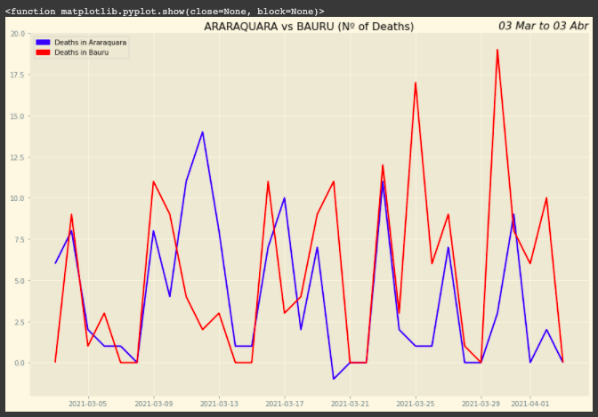

### 5.3.3 - Hospital Occupancy Rate
```python
#filtering the range of the dates that we will need
afterSituation = ocuppancyRateCitiesdf.loc['2021-03-03':'2021-04-03']
afterSituation.reset_index(inplace = True)
```
```python
#creating the range of dates that we will use as x axis
x_axis = pd.date_range(start="2021-03-03",end="2021-04-03")

#we will use both cities in y axis
cityFilterAraraquara = afterSituation.loc[(afterSituation['nome_drs'] == 'DRS 03 Araraquara')]
occupancyAraraquara = cityFilterAraraquara.filter(items = ['ocupacao_leitos_ultimo_dia'])
occupancyAraraquaraconverted = [i.replace(',', '.') for i in occupancyAraraquara['ocupacao_leitos_ultimo_dia']]

cityFilterBauru = afterSituation.loc[(afterSituation['nome_drs'] == 'DRS 06 Bauru')]
occupancyBauru = cityFilterBauru.filter(items = ['ocupacao_leitos_ultimo_dia'])
occupancyBauruconverted = [i.replace(',', '.') for i in occupancyBauru['ocupacao_leitos_ultimo_dia']]

#putting everything together on the graph
plt.figure(figsize=(20,15))
plt.style.use('Solarize_Light2')
plt.title('ARARAQUARA vs BAURU (Occupancy Rate)')
plt.title('03 Mar to 03 Abr', loc='right', fontstyle='italic')
plt.plot(x_axis,occupancyAraraquaraconverted, color='blue')
plt.plot(x_axis,occupancyBauruconverted, color='red')
araraquaraLabel = mpatches.Patch(color='blue', label='Occupancy Rate from Araraquara')
bauruLabel = mpatches.Patch(color='red', label='Occupancy Rate from Bauru')
plt.legend(handles=[araraquaraLabel,bauruLabel])
plt.show
```

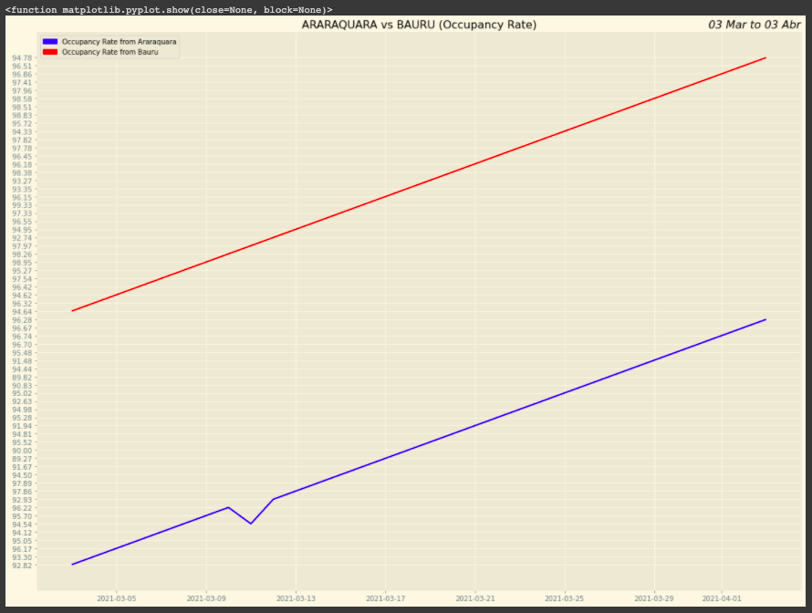

### 5.3.4 - Patients in Nursing Beds for COVID-19
```python
#creating the range of dates that we will use as x axis
x_axis = pd.date_range(start="2021-03-03",end="2021-04-03")

#we will use both cities in y axis
cityFilterAraraquara = previousSituation.loc[(previousSituation['nome_drs'] == 'DRS 03 Araraquara')]
nursingBedsAraraquara = cityFilterAraraquara.filter(items = ['pacientes_enf_ultimo_dia'])

cityFilterBauru = previousSituation.loc[(previousSituation['nome_drs'] == 'DRS 06 Bauru')]
nursingBedsBauru = cityFilterBauru.filter(items = ['pacientes_enf_ultimo_dia'])

#putting everything together on the graph
plt.figure(figsize=(20,15))
plt.style.use('Solarize_Light2')
plt.title('ARARAQUARA vs BAURU (Patients in Nursing beds)')
plt.title('21 Jan to 21 fev', loc='right', fontstyle='italic')
plt.plot(x_axis,nursingBedsAraraquara, color='blue')
plt.plot(x_axis,nursingBedsBauru, color='red')
araraquaraLabel = mpatches.Patch(color='blue', label='Patients in Nursing beds from Araraquara')
bauruLabel = mpatches.Patch(color='red', label='Patients in Nursing beds from Bauru')
plt.legend(handles=[araraquaraLabel,bauruLabel])
plt.show
```

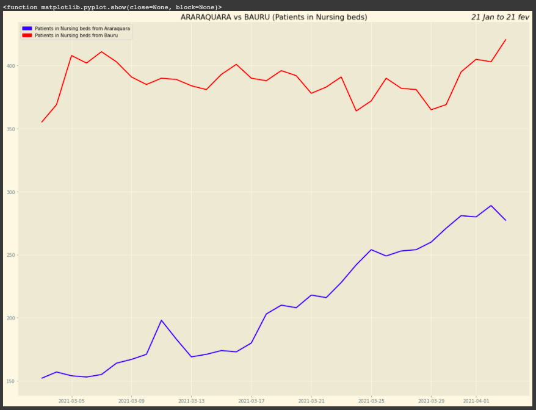

## 5.4 - Before and After Lockdown visualization
```python
#filtering the range of the dates that we will need
beforeAndAfterSituation = casesAndDeathCitiesdf.loc['2021-01-21':'2021-04-03']
beforeAndAfterSituation.reset_index(inplace = True)
```
### 5.4.1 - New cases
```python 
#creating the range of dates that we will use as x axis
x_axis = pd.date_range(start="2021-01-21",end="2021-04-03")

#we will use both cities in y axis
araraquaraFilter = beforeAndAfterSituation.loc[(beforeAndAfterSituation['city'] == 'Araraquara')]
confirmedAraraquara = araraquaraFilter.filter(items = ['new_confirmed'])

bauruFilter = beforeAndAfterSituation.loc[(beforeAndAfterSituation['city'] == 'Bauru')]
confirmedBauru = bauruFilter.filter(items = ['new_confirmed'])

#putting everything together on the graph
plt.figure(figsize=(15,10))
plt.title('ARARAQUARA vs BAURU (Nº of News Cases)')
plt.title('21 Jan to 21 Abr', loc='right', fontstyle='italic')
plt.plot(x_axis,confirmedAraraquara, color='blue')
plt.plot(x_axis,confirmedBauru, color='red')
araraquaraLabel = mpatches.Patch(color='blue', label='New Cases Araraquara')
bauruLabel = mpatches.Patch(color='red', label='New Cases Bauru')
plt.legend(handles=[araraquaraLabel,bauruLabel])
plt.show
```

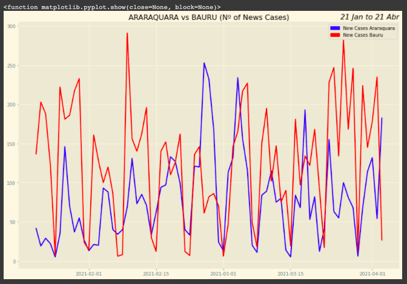

### 5.4.2 - Number of Deaths
```python
#creating the range of dates that we will use as x axis
x_axis = pd.date_range(start="2021-01-21",end="2021-04-03")

#we will use both cities in y axis
araraquaraFilter = beforeAndAfterSituation.loc[(beforeAndAfterSituation['city'] == 'Araraquara')]
confirmedAraraquara = araraquaraFilter.filter(items = ['new_deaths'])

bauruFilter = beforeAndAfterSituation.loc[(beforeAndAfterSituation['city'] == 'Bauru')]
confirmedBauru = bauruFilter.filter(items = ['new_deaths'])

#putting everything together on the graph
plt.figure(figsize=(15,10))
plt.title('ARARAQUARA vs BAURU (Nº of Deaths)')
plt.title('21 Jan to 21 Abr', loc='right', fontstyle='italic')
plt.plot(x_axis,confirmedAraraquara, color='blue')
plt.plot(x_axis,confirmedBauru, color='red')
araraquaraLabel = mpatches.Patch(color='blue', label='Deaths in Araraquara')
bauruLabel = mpatches.Patch(color='red', label='Deaths in Bauru')
plt.legend(handles=[araraquaraLabel,bauruLabel])
plt.show
```

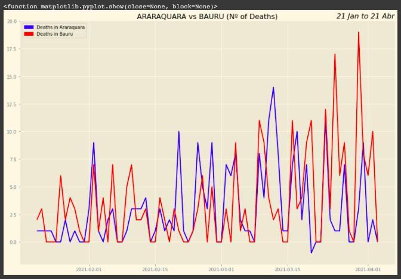

### 5.4.3 - Hospital Occupancy Rate
```python
beforeAndAfterSituation = ocuppancyRateCitiesdf.loc['2021-01-21':'2021-04-03']
beforeAndAfterSituation.reset_index(inplace = True)
```
```python
#creating the range of dates that we will use as x axis
x_axis = pd.date_range(start="2021-01-21",end="2021-04-03")

#we will use both cities in y axis
cityFilterAraraquara = beforeAndAfterSituation.loc[(beforeAndAfterSituation['nome_drs'] == 'DRS 03 Araraquara')]
occupancyAraraquara = cityFilterAraraquara.filter(items = ['ocupacao_leitos_ultimo_dia'])
occupancyAraraquaraconverted = [i.replace(',', '.') for i in occupancyAraraquara['ocupacao_leitos_ultimo_dia']]

cityFilterBauru = beforeAndAfterSituation.loc[(beforeAndAfterSituation['nome_drs'] == 'DRS 06 Bauru')]
occupancyBauru = cityFilterBauru.filter(items = ['ocupacao_leitos_ultimo_dia'])
occupancyBauruconverted = [i.replace(',', '.') for i in occupancyBauru['ocupacao_leitos_ultimo_dia']]

#putting everything together on the graph
plt.figure(figsize=(25,40))
plt.style.use('Solarize_Light2')
plt.title('ARARAQUARA vs BAURU (Occupancy Rate)')
plt.title('21 Jan to 21 Abr', loc='right', fontstyle='italic')
plt.plot(x_axis,occupancyAraraquaraconverted, color='blue')
plt.plot(x_axis,occupancyBauruconverted, color='red')
araraquaraLabel = mpatches.Patch(color='blue', label='Occupancy Rate from Araraquara')
bauruLabel = mpatches.Patch(color='red', label='Occupancy Rate from Bauru')
plt.legend(handles=[araraquaraLabel,bauruLabel])
plt.show
```
